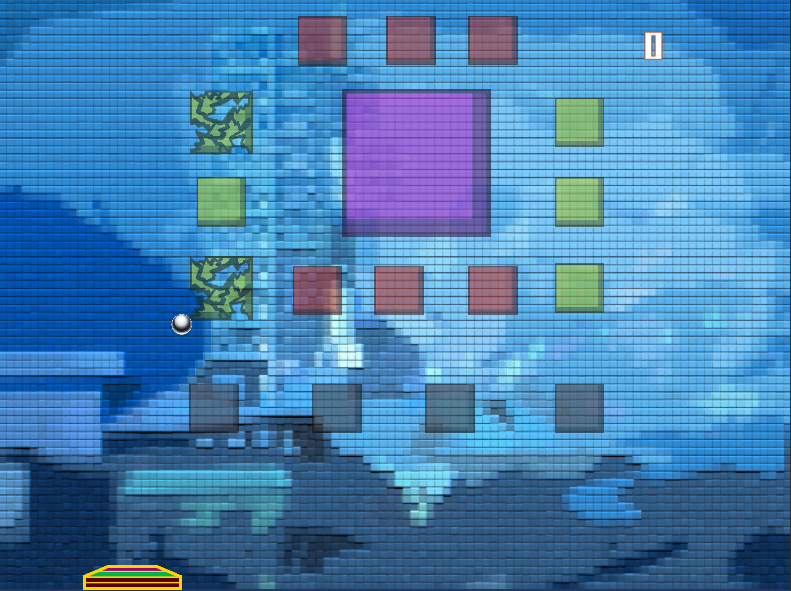

# Block Breaker

Project build on the Unity Game Engine and using C# programming language where I built an scalable game called "Block Breaker" following the guide in the Udemy course "Complete C# Unity Game Developer 2D" created by Ben Tristem, GameDev.tv Team and Rick Davidson.

The Game has 4 scenes: Start Menu, Level 1, Level 2 and Game Over but it can be added more scenes as levels with different blocks positions and different types of blocks. 

This project

## Built With
- Unity game Engine
- C# Programming Language
- Unity C# Libraries 

## Authors
### Author1
- 👤GitHub: [Jose Abel Ramirez](https://github.com/jose-Abel)

## Getting Started
You can clone this code anytime and open the project with Unity. Also there's a compile version included for Windows.

## Live version
In the folder "Build for Windows" there is a build version of the game for Windows.

### Setup
You can either copy the code with git clone or just do a git pull on your local environment.

### Acknowledgments
Appreciate the teams at Udemy and the creators of the course Ben Tristem, GameDev.tv Team and Rick Davidson since allows me to learn a lot of C# and using the Unity Game Engine.

## 📝 License
This project is MIT licensed.

## Show your support
Give a ⭐️ if you like this project!